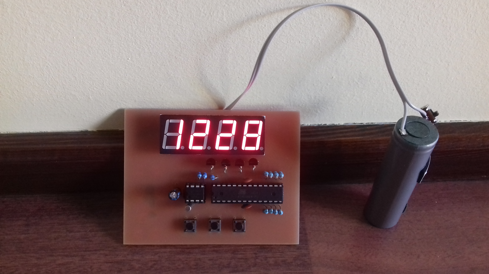

# SMiW-proj
An ATmega16 based clock on steroids

This is DS1307 + ATmega based digital clock, made for Embedded Systems course. Developed on mega16 at the university (cause everyone were using mega8 for no reason), switched to mega8 later.
Includes multiplexing, I2C interfacing and buttons for setting time, brightness and other settings.

In the second version I remade it to work fully on a single 18650 battery (lasts for a week or so on a cheap cell extracted from a broken powerbank), with battery voltage monitoring. USB charger module and boost module (3.7 -> 5) are glued on the backside.

